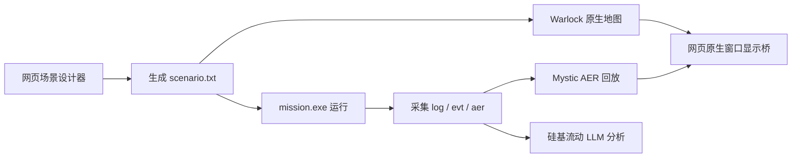

# AFSIM_LLM 架构

## 定位

AFSIM_LLM 是 AFSIM 的 Web 编排层，不替代 Warlock、Mystic，也不再维护自绘 2D/3D 战场地图。网页端承担场景设计、脚本生成、运行控制、输出采集、窗口嵌入和大模型分析；AFSIM 原生工具承担地图、三维和回放显示。

## 当前闭环

## 后端模块

- `app/main.py`：FastAPI 路由、静态页面、AFSIM API。
- `app/services/afsim_design.py`：网页场景设计转 AFSIM 输入文件。
- `app/services/afsim_runner.py`：发现 demo、运行 `mission.exe`、启动 Warlock/Mystic、采集输出。
- `app/services/afsim_parser.py`：解析 scenario/include 中的平台、阵营、类型和位置。
- `app/services/native_display.py`：检测 Warlock/Mystic 本机窗口，并为网页提供原生窗口截图。
- `app/services/llm.py`：硅基流动 OpenAI 兼容 API 适配和本地兜底分析。
- `app/static/`：AFSIM 原生工作台前端。

## 原生显示方案

当前提供两种模式：

- 本机窗口截图：后端只匹配标题包含 `Warlock` 或 `Mystic` 的窗口，网页定时刷新截图，适合单机落地演示和调试。
- 外部交互流：配置 `AFSIM_NATIVE_STREAM_URL` 后，中间工作区以 iframe 嵌入 noVNC、RDP 网关或 WebRTC 桌面流。

本机截图模式是只读显示桥；完整鼠标键盘交互需要外部桌面流服务。

## 安全边界

LLM 只用于封闭仿真工程分析、场景检查和复盘建议。系统不执行真实世界作战命令，不输出武器释放、杀伤或规避拦截等现实伤害性指令。生成场景用于 AFSIM 仿真验证。

## 下一步

- 将 AFSIM base_types、demo 类型库整理为可选模板库。
- 增加更完整的航路编辑、批量平台导入和场景版本管理。
- 深入解析 `.evt/.aer`，形成时间索引态势数据。
- 接入正式 noVNC/RDP/WebRTC 服务，提供可交互的网页内嵌 Warlock/Mystic。
- 增加数据库化场景库、运行库、复盘库和权限审计。
