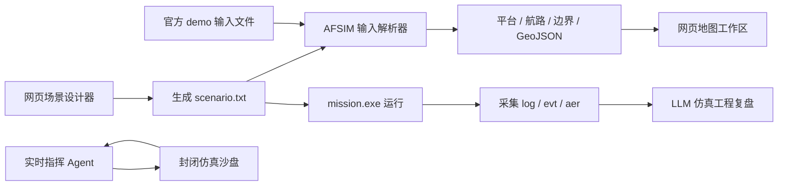

# AFSIM_LLM 架构

## 定位

AFSIM_LLM 是 AFSIM 的 Web 数据解析与仿真工程工作台。它不再调用 Warlock 做网页实时显示，也不再把 Mystic 回放作为主界面能力。当前主线是把 AFSIM 的输入文件、生成场景和运行输出解析成结构化数据，再由网页地图、场景库、运行记录和 LLM 复盘组成开发闭环。

Warlock/Mystic 可以作为外部 AFSIM 工具单独打开用于人工对照，但它们不属于本系统的网页渲染链路。

## 当前闭环



## 后端模块

- `app/main.py`：FastAPI 路由、静态页面、AFSIM API。
- `app/services/afsim_design.py`：网页场景设计转 AFSIM 输入文件。
- `app/services/afsim_parser.py`：递归解析 scenario/include 中的平台、阵营、类型、位置、航路、边界和 GeoJSON。
- `app/services/afsim_runner.py`：发现 demo、运行 `mission.exe`、采集输出、列出运行记录。
- `app/services/simulation.py`：实时指挥 Agent 使用的封闭仿真沙盘状态和白名单指令应用。
- `app/services/llm.py`：硅基流动 OpenAI 兼容 API 适配、实时指挥建议和本地兜底分析。
- `app/static/`：网页地图工作台前端。

## 前端模块

- 场景设计器：维护设计表单和平台编辑器，提交 `POST /api/afsim/designs`。
- 场景库：读取生成场景，展示 `scenario.txt`，支持删除和重新运行。
- AFSIM 解析视图：展示解析出的平台表、坐标、阵营、类型和摘要。
- 网页地图工作区：使用解析器返回的 `bounds`、`platforms` 和 `geojson` 渲染平台点位与航路。
- 运行/复盘面板：运行生成场景或 demo，并把最近运行交给 LLM 分析。

## 数据设计

解析器返回的核心结构：

```json
{
  "input_file": "scenario.txt",
  "included_files": ["scenario.txt", "setup.txt"],
  "platform_count": 2,
  "route_count": 1,
  "bounds": {
    "min_lat": 1.05,
    "max_lat": 1.20,
    "min_lon": 1.05,
    "max_lon": 1.30
  },
  "platforms": [],
  "geojson": {
    "type": "FeatureCollection",
    "features": []
  }
}
```

这让前端不直接理解 AFSIM 文本语法，而是消费稳定的结构化结果。后续扩展传感器、武器、通信链路和任务段时，优先在解析器输出中增加结构化字段，再让前端按字段渲染图层。

## Agent 方向

当前版本先用轻量编排实现可落地闭环：前端设置目标、指挥方、步长和自治模式，后端推进封闭仿真沙盘，调用硅基流动模型输出 JSON 指令，再由白名单执行器应用到仿真状态。此阶段不强依赖 LangChain，原因是工具数量和状态机还不复杂，直接代码更容易审计和落地。

当后续加入更多工具时，再把这一层迁移到 LangGraph/LangChain 更合适，例如：AFSIM 场景检查工具、`.evt/.aer` 时序解析工具、场景版本工具、RAG 知识库工具和权限审计工具。

## 安全边界

LLM 只用于封闭仿真工程分析、场景检查、复盘建议和仿真内态势管理。系统不执行真实世界作战命令，不输出武器释放、杀伤或规避拦截等现实伤害性指令。生成场景用于 AFSIM 仿真验证。

## 下一步

- 扩展 AFSIM base_types、demo 类型库，形成分层平台模板库。
- 增加更完整的航路编辑、批量平台导入和场景版本管理。
- 深入解析 `.evt/.aer`，形成时间索引态势数据。
- 将网页地图升级为多图层态势视图，支持底图、筛选、实体检索和时间轴。
- 将实时 Agent 升级为 LangGraph/LangChain 工具编排，并加入人工审批、记忆和任务规划。
- 增加数据库化场景库、运行库、复盘库和权限审计。
